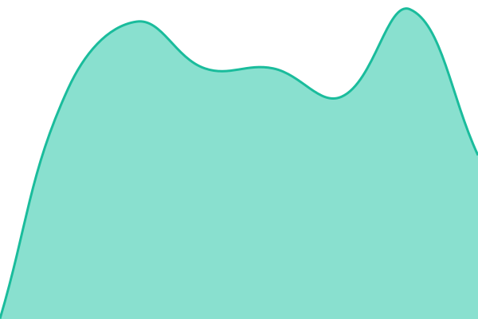

# [Storno Status](https://status.storno.ro)

This repository contains the status page for [Storno](https://storno.ro), powered by [Upptime](https://github.com/upptime/upptime).

Live status: **https://status.storno.ro**

<!--start: status pages-->
<!-- This summary is generated by Upptime (https://github.com/upptime/upptime) -->
<!-- Do not edit this manually, your changes will be overwritten -->
<!-- prettier-ignore -->
| URL | Status | History | Response Time | Uptime |
| --- | ------ | ------- | ------------- | ------ |
|  [Storno App](https://app.storno.ro) | 🟩 Up | [storno-app.yml](https://github.com/stornoro/status/commits/HEAD/history/storno-app.yml) | 

 1052ms
     
 | 

<a href="https://status.storno.ro/history/storno-app">99.64%</a>
    

|  [Storno API](https://api.storno.ro/health) | 🟩 Up | [storno-api.yml](https://github.com/stornoro/status/commits/HEAD/history/storno-api.yml) | 

 517ms
     
 | 

<a href="https://status.storno.ro/history/storno-api">99.65%</a>
    

|  [Landing Page](https://storno.ro) | 🟩 Up | [landing-page.yml](https://github.com/stornoro/status/commits/HEAD/history/landing-page.yml) | 

 641ms
     
 | 

<a href="https://status.storno.ro/history/landing-page">99.65%</a>
    

|  [Documentation](https://docs.storno.ro) | 🟩 Up | [documentation.yml](https://github.com/stornoro/status/commits/HEAD/history/documentation.yml) | 

 600ms
     
 | 

<a href="https://status.storno.ro/history/documentation">99.65%</a>
    

<!--end: status pages-->
